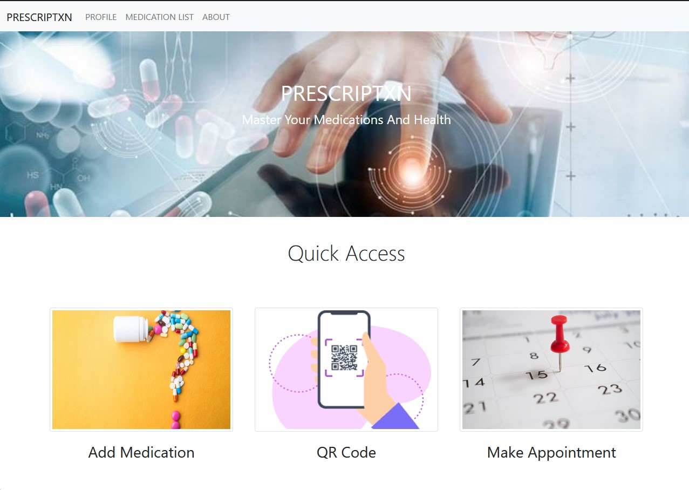
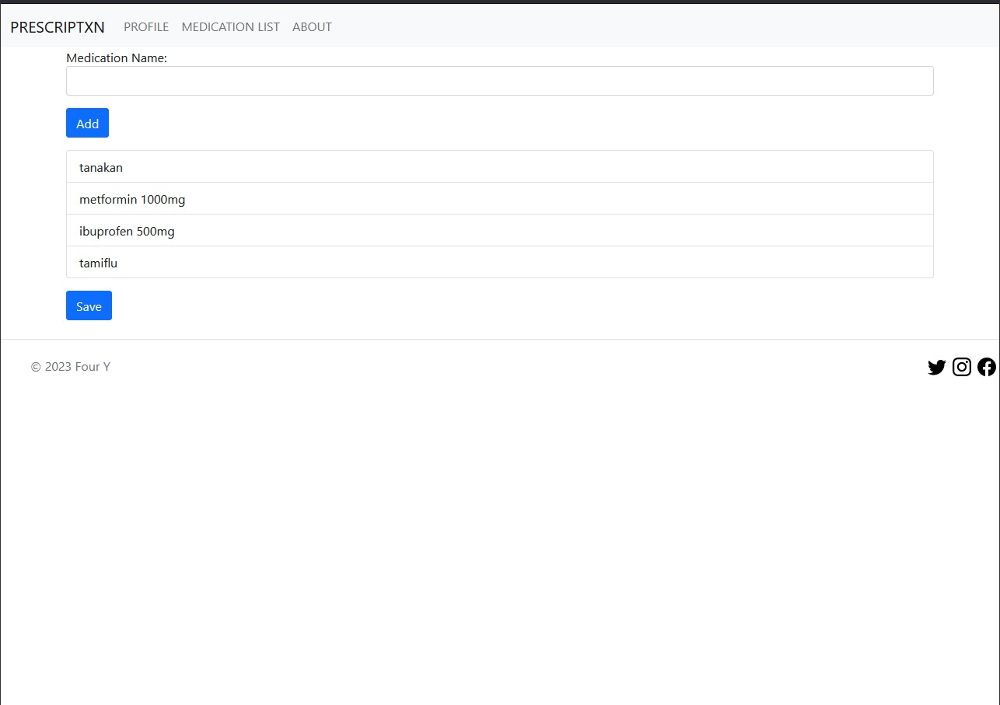
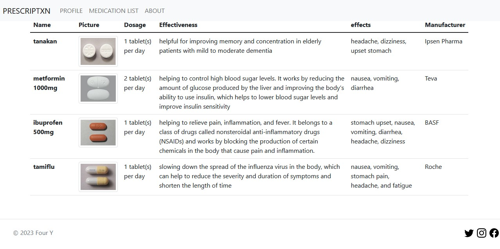
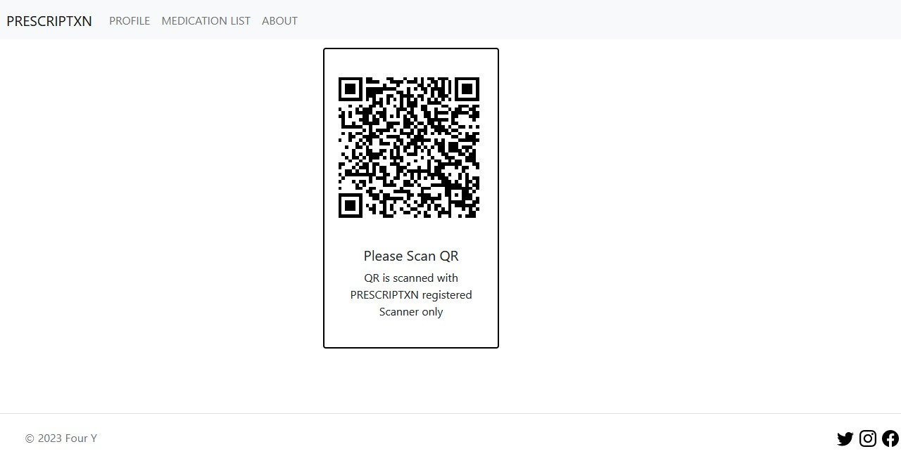
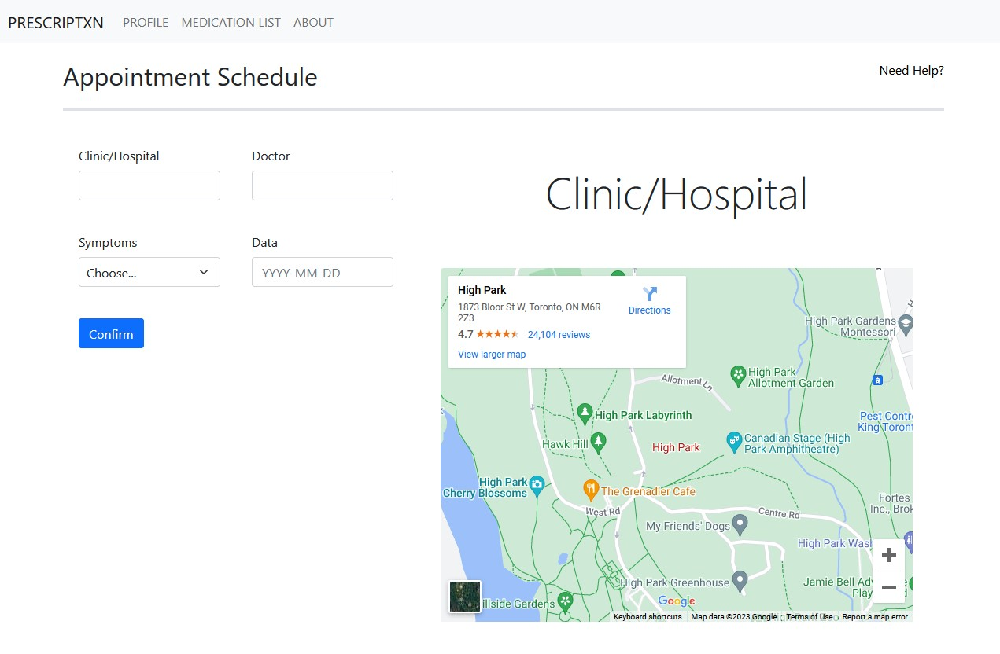
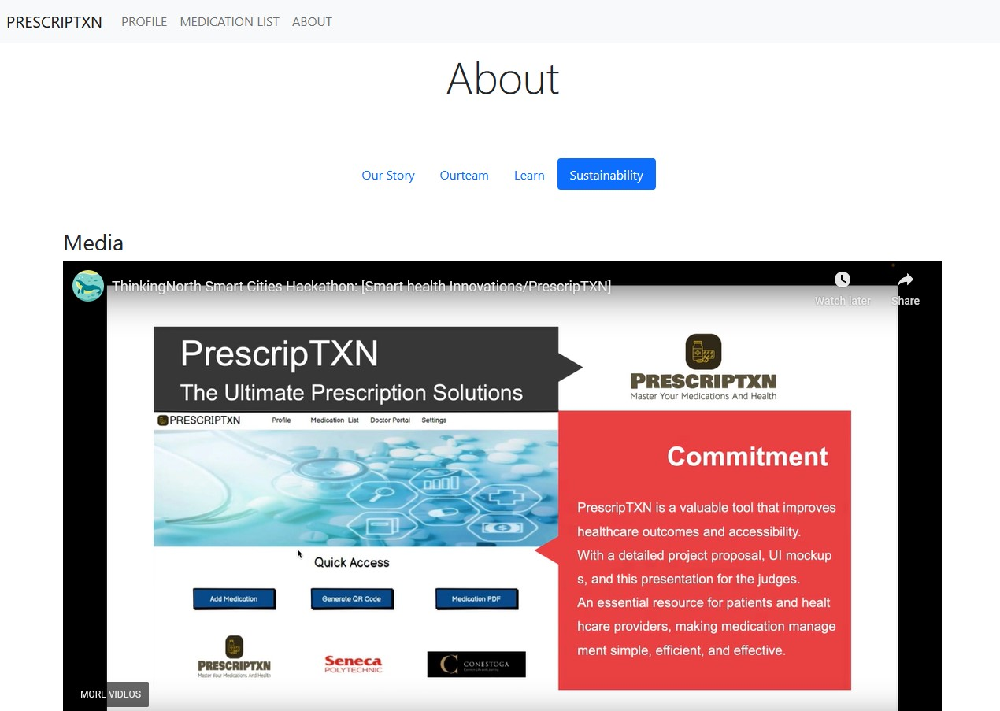

<h1 align="center">
    PRESCRIPTXN
</h1>

PRESCRIPTXN is a system that was developed during 2023 Smart Cities Hackathon - Smart Health. This system simplifies the medication process for patients and all stakeholders involved, by providing clear medication history information. PRESCRIPTXN consists of patient, pharmacy, and clinic/hospital modules, and allows users to access patient-friendly prescription information that is AI-processed from FDA medication information. Users can easily check this information anytime, and can quickly access the clinic and receive their medication from the pharmacy using QR codes. This system also enables organizations to efficiently manage patients' prescription history, resulting in streamlined operations, reduced time, and effective data management.

## Contents

- [Solution](#-Solution)
- [Minimum viable Product](#-MVP)

## Solution

## MVP

